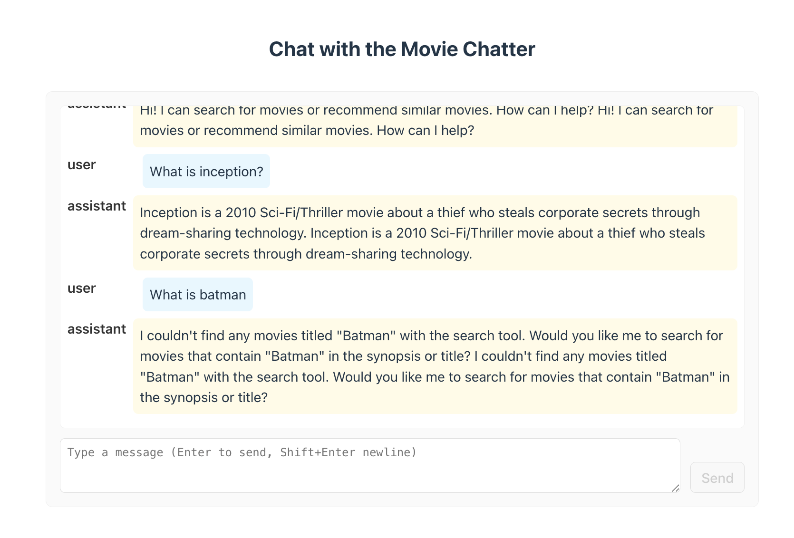

# z-movie-app

Lightweight demo that shows a small Python "agent" backend paired with a React/Vite frontend. The app demonstrates a chat UI that sends messages to a local agent server and displays streaming responses (SSE-like) from the server.


Process flow (client ↔ server):

```
	+-------------+            POST /apps/{app}/users/{user}/sessions            +-------------+
	|   Browser   |  ------------------------------------------------------->    |  Backend    |
	| (React App) |                                                              |  (Agent)    |
	+-------------+   <--------------------------------------------------------  +-------------+
			|  ^                         returns session id (JSON)                      ^
			|  |                                                                        |
			|  |  POST /run_sse (payload includes session_id, new_message, streaming)   |
			|  | ---------------------------------------------------------------->      |
			|  |                                                                        |
			|  |  <-- streaming response (SSE-like `data:` frames with JSON payloads)   |
			v  |                                                                        |
	+-------------+                                                                     |
	| Chat UI     |  <-- parse `data:` lines, extract `content.parts[].text`, type out  |
	| (Chat.jsx)  |      characters progressively to simulate typing                    |
	+-------------+                                                                     |
```


This repository contains two main parts:

- `movie-agent-server/` — Python agent and API server code. The server exposes endpoints used by the client (session creation and a streaming `/run_sse` endpoint). The project uses a small in-memory movie dataset and a simple agent implementation.
- `movie-client/` — React + Vite frontend that implements a chat interface, session management, request wiring, and streaming response parsing/display.

## Technologies used

- Frontend
	- React (functional components + hooks)
	- Vite (dev server and build)
	- Plain CSS for styling
- Backend
	- Python modules under `movie-agent-server/` (local development entrypoint uses `adk api_server` in this project)
	- The code includes a small in-memory agent (`movie-tool-agent`) demonstrating search/recommendation tools
- Dev tooling and concepts
	- Fetch + ReadableStream (streaming responses)
	- Server-Sent Events (SSE)-style payload parsing
	- AbortController to cancel requests
	- Vite dev-server proxy to avoid CORS during development
	- localStorage for session persistence

## What you can learn from this project

- How to stream server responses into a React UI using the Fetch Streams API and progressively update the UI as data arrives.
- How to parse SSE-style text frames and extract structured payloads (JSON) sent inside `data:` lines.
- How to create and reuse a server-side session from the client, and persist the session id to `localStorage`.
- How to simulate a typing effect by queuing incoming chunks and rendering them character-by-character.
- How to handle common web dev issues like CORS and how to quickly fix them during development using a Vite proxy.

## Project structure (high level)

- movie-agent-server/
	- movie-tool-agent/: agent implementation and helper tools
	- (run the API server with `adk api_server --port 9000` in this repo — see local scripts/notes)
- movie-client/
	- src/Chat.jsx — the chat UI and streaming client logic
	- src/App.jsx — app shell that imports the Chat component
	- src/App.css — chat styles
	- vite.config.js — Vite config with a dev-server proxy for `/apps` and `/run_sse`

## Setup and run (local development)

Prerequisites:

- Node.js (for the frontend)
- Python and any dependencies required by the backend (`adk` tool used here for local development)

1) Start the backend API server

```bash
cd movie-agent-server
# Start the API server used by the client. This repository uses the ADK dev server command during development:
adk api_server --port 9000 --alow_origins="*
# (Or run your backend entrypoint / framework runner that binds to port 9000.)
```

2) Start the frontend dev server

```bash
cd movie-client
npm install    # first time only
npm run dev
```

3) Open the browser at the Vite URL printed by `npm run dev` (usually `http://localhost:5173` or similar). The chat UI is available on the page.

Notes on CORS and proxying

- The frontend config (`movie-client/vite.config.js`) contains a dev-server proxy that forwards `/apps` and `/run_sse` to `http://localhost:9000`. This avoids CORS during development.
- If you prefer not to use the Vite proxy, enable CORS on the backend (add appropriate middleware for your framework) so the browser can reach `http://localhost:9000` directly.

## Chat behavior and endpoints

- When the client sends a message, it first ensures a session exists by POSTing to:

	`/apps/movie-tool-agent/users/movie_guest/sessions` (body `{ state: {} }`)

	The server returns a session `id` which the client caches in `localStorage` under `movie_tool_agent_session_id`.

- The chat POST to `/run_sse` sends a JSON payload like:

```json
{
	"app_name": "movie-tool-agent",
	"user_id": "movie_guest",
	"session_id": "<session-id>",
	"new_message": {
		"role": "user",
		"parts": [{ "text": "Hey what's the weather?" }]
	},
	"streaming": true
}
```

- The client expects the server to stream SSE-style frames. Each frame may include lines prefixed with `data:` containing JSON. The client parses these frames and extracts the human-readable text (typically under `content.parts[].text`) and types it out with a short per-character delay to simulate an LLM typing.

## Debugging & troubleshooting

- If you see a CORS error in the browser console, make sure either:
	- the Vite dev server is running with its proxy (recommended for local dev), or
	- your backend is configured to allow CORS from the frontend origin.
- Browser console logs: the client contains `console.log` statements that show session creation responses, the exact payload POSTed to `/run_sse`, each incoming raw stream chunk, the extracted text, and errors — open DevTools → Console to inspect.
- To reset the saved session id: clear local storage key `movie_tool_agent_session_id` in DevTools Application tab, or run `localStorage.removeItem('movie_tool_agent_session_id')` in the console.

## Next steps and improvements

- Add a small UI control to clear/reset the session id (a "reset conversation" button).
- Add a toggle to switch instant vs typing-mode responses.
- Improve SSE parsing to support other event fields (`event:`, `id:`) or multipart candidate streams.
- Add tests for the parser and a tiny integration test that mocks a streaming response.

## Contact / notes

This repository is a compact demo for streaming chat from a local agent server into a React UI.
